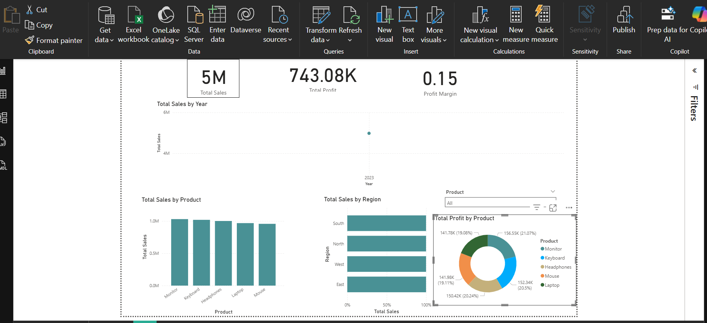

# Sales-and-Profit-Analysis-Dashboard
Power BI dashboard analyzing sales and profit insights using DAX and Power Query.
# Sales & Profit Analysis Dashboard — Power BI

This project presents an interactive **Sales and Profit Analysis Dashboard** built in **Power BI**.  
It provides key business insights related to total sales, profit margins, product performance, and regional trends.

---

##  Key Features

### **KPI Cards**
| Metric | Description |
|-------|-------------|
| **Total Sales** | Total revenue generated across all products |
| **Total Profit** | Net profit after cost deductions |
| **Profit Margin** | Profitability ratio (Profit ÷ Sales) |

### **Visuals Included**
| Visualization | Purpose |
|--------------|---------|
| **Line Chart — Total Sales by Year** | Shows yearly sales growth trend |
| **Bar Chart — Total Sales by Product** | Identifies high and low performing products |
| **Bar Chart — Total Sales by Region** | Compares regional business performance |
| **Donut Chart — Total Profit by Product** | Shows contribution of each product to total profit |
| **Slicers (Filters)** | Filter dashboard by **Product, Region, Date** in real-time |

---

## Dataset Used

**File:** `sales_profit_dataset.csv`  
The dataset includes the following fields:

| Column | Description |
|--------|-------------|
| `Product` | Product category (Laptop, Monitor, Mouse, etc.) |
| `Region` | Sales region (North, South, East, West) |
| `Date` | Transaction/record date |
| `Sales` | Revenue generated |
| `Cost` | Expense associated with the sale |
| `Profit` | (Sales - Cost) |

---

## Tools & Technologies
| Tool | Purpose |
|------|---------|
| **Power BI Desktop** | Data modeling & dashboard development |
| **DAX** | KPI calculations |
| **CSV Dataset** | Raw data source |

---

## Dashboard Preview

---

##  Insights & Observations
- The **highest sales** were generated by **Monitors** and **Keyboards**.
- **Profit is evenly distributed**, but some products show higher margins.
- Certain regions outperform others, indicating **market growth opportunities**.

---

##  How to Use the Dashboard
1. Download the `.pbix` file
2. Open it in **Power BI Desktop**
3. Use the slicers to filter by **Product**, **Region**, or **Date**

---

## 🔗 Project Link
https://github.com/<akshay18463>/sales-profit-analysis-dashboard
